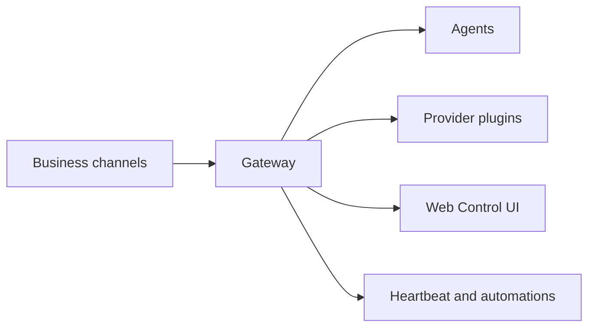

# OpenClaw 🦞

<p align="center">
    
    
</p>

> _"EXFOLIATE! EXFOLIATE!"_ — A space lobster, probably

<p align="center">
  <strong>Web-based control plane for multi-agent business automation across WhatsApp, Telegram, and retained provider backends.</strong><br />
  Operate channels, sessions, and agents from a browser-first SaaS surface.
</p>

<Columns>
  <Card title="Open the Control UI" href="/web/control-ui" icon="layout-dashboard">
    Launch the browser dashboard for channels, sessions, and admin controls.
  </Card>
  <Card title="Platform Overview" href="/web/index" icon="rocket">
    Start with the retained web, gateway, and channel surfaces.
  </Card>
</Columns>

## What is OpenClaw?

OpenClaw is a **web-first gateway and control plane** that connects retained business messaging channels to AI agents and provider backends. This fork is being shaped into a SaaS-oriented operations platform: the browser UI is the main entry point, while the gateway remains the core runtime for sessions, routing, and automation.

**Who is it for?** Teams building a browser-managed, multi-agent business workflow system on top of a retained gateway backbone.

**What makes it different?**

- **Web-first**: browser admin UI is the primary control surface
- **Retained channels**: focused runtime surface for WhatsApp and Telegram
- **Agent-native**: sessions, memory, routing, and multi-agent execution remain central
- **Extensible providers**: reduced provider set for the retained model backends

**What do you need?** Node 24 (recommended), or Node 22 LTS (`22.14+`) for compatibility, an API key from your chosen provider, and 5 minutes. For best quality and security, use the strongest latest-generation model available.

## How it works



The Gateway is the single source of truth for sessions, routing, and channel connections.

## Key capabilities

<Columns>
  <Card title="Channel gateway" icon="network">
    WhatsApp and Telegram channel runtime with a single Gateway process.
  </Card>
  <Card title="Reduced plugin surface" icon="plug">
    Focused provider and channel plugins for a lighter SaaS-oriented core.
  </Card>
  <Card title="Multi-agent routing" icon="route">
    Isolated sessions per agent, workspace, or sender.
  </Card>
  <Card title="Web Control UI" icon="monitor">
    Browser dashboard for chat, config, sessions, and operations.
  </Card>
</Columns>

Need the full install and dev setup? See [Getting Started](/start/getting-started).

## Dashboard

Open the browser Control UI after the Gateway starts.

- Local default: [http://127.0.0.1:18789/](http://127.0.0.1:18789/)
- Remote access: [Web surfaces](/web) and [Tailscale](/gateway/tailscale)

<p align="center">
  
</p>

## Configuration (optional)

Config lives at `~/.openclaw/openclaw.json`.

- If you **do nothing**, OpenClaw uses the bundled Pi binary in RPC mode with per-sender sessions.
- If you want to lock it down, start with `channels.whatsapp.allowFrom` and (for groups) mention rules.

Example:

```json5
{
  channels: {
    whatsapp: {
      allowFrom: ["+15555550123"],
      groups: { "*": { requireMention: true } },
    },
  },
  messages: { groupChat: { mentionPatterns: ["@openclaw"] } },
}
```

## Start here

<Columns>
  <Card title="Docs hubs" href="/start/hubs" icon="book-open">
    All docs and guides, organized by use case.
  </Card>
  <Card title="Configuration" href="/gateway/configuration" icon="settings">
    Core Gateway settings, tokens, and provider config.
  </Card>
  <Card title="Remote access" href="/gateway/remote" icon="globe">
    SSH and tailnet access patterns.
  </Card>
  <Card title="Channels" href="/channels/telegram" icon="message-square">
    Channel-specific setup for WhatsApp, Telegram, Discord, and more.
  </Card>
  <Card title="Nodes" href="/nodes" icon="smartphone">
    iOS and Android nodes with pairing, Canvas, camera, and device actions.
  </Card>
  <Card title="Help" href="/help" icon="life-buoy">
    Common fixes and troubleshooting entry point.
  </Card>
</Columns>

## Learn more

<Columns>
  <Card title="Full feature list" href="/concepts/features" icon="list">
    Complete channel, routing, and media capabilities.
  </Card>
  <Card title="Multi-agent routing" href="/concepts/multi-agent" icon="route">
    Workspace isolation and per-agent sessions.
  </Card>
  <Card title="Security" href="/gateway/security" icon="shield">
    Tokens, allowlists, and safety controls.
  </Card>
  <Card title="Troubleshooting" href="/gateway/troubleshooting" icon="wrench">
    Gateway diagnostics and common errors.
  </Card>
  <Card title="About and credits" href="/reference/credits" icon="info">
    Project origins, contributors, and license.
  </Card>
</Columns>
